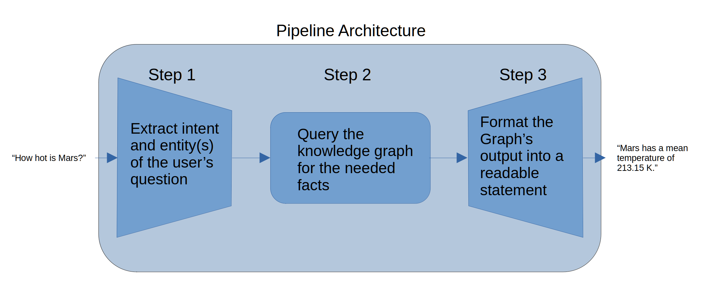

# Astronomy KG QA System

**DATA/MSML 641 — Natural Language Processing | Final Project**
**Author:** Abigail Basener | University of Maryland

A question-answering system for astronomy queries backed by a locally hosted
knowledge graph built from DBpedia. The pipeline runs fully offline after
first setup: the user asks a natural-language question, the system extracts
entities and intent using pre-trained NLP models, queries the local RDF graph
with SPARQL, and returns a formatted natural-language answer.

---

## Quick Start

```bash
# 1. Install dependencies
pip install -r requirements.txt

# 2. Download NLTK data (one-time, ~3 MB)
python3 -c "import nltk; nltk.download('punkt_tab')"

# 3. Launch the GUI
python3 astronomy_gui.py
```

> **First run only:** The two HuggingFace models (`dslim/bert-base-NER` and
> `facebook/bart-large-mnli`) are downloaded automatically on first launch
> (~2 GB total). They are cached locally after that and work offline.

---

## Files

### Core system

| File | Description |
|------|-------------|
| `astronomy_gui.py` | Standalone GUI application. Contains the full pipeline (NER → intent → SPARQL → template) and a Tkinter GUI. THis is the deployed vertoin |
| `astronomy_kg.ttl` | Local RDF knowledge graph. A curated DBpedia astronomy subgraph in Turtle format (3,155 triples, ~70 objects). This is the data the system queries at runtime. |

### Data collection

| File | Description |
|------|-------------|
| `fetch_objects.py` | Data preprocessing script. Queries the live DBpedia SPARQL endpoint and appends triples to `astronomy_kg.ttl`. Run once with an internet connection. The KG works offline after that. To add new objects edit this file. |

### Evaluation and testing

| File | Description |
|------|-------------|
| `TestJNB.ipynb` | Main evaluation notebook. Covers all three evaluation tiers: Tier 1 (automatic pipeline stats and confidence calibration), Tier 2 (ROUGE, BLEU, BERTScore vs. keyword baseline), and Tier 3 (human-judge ratings and Cohen's Kappa). Also the notebook that the pipline was orginaly biult in before being deployed to the GUI interface. |
| `test_pipeline.py` | Unit tests for individual pipeline functions. 33 tests across 7 test classes. No models or KG file required. |
| `eval_questions.txt` | Question bank: 120 questions across 7 intent types plus filter queries and expected-failure cases. Loaded by the notebook and GUI at runtime. |
| `tier2_references.txt` | Human-written reference answers for Tier 2 metric evaluation. Used for ROUGE/BLEU and BERTScore. |

### Setup and documentation

| File | Description |
|------|-------------|
| `requirements.txt` | Python package dependencies with pinned versions. |
| `README.tex` | This document to outline the tecknical side of the project. |

---

## Running the Tests
Run 'test_pipeline.py' and review the output in the terminal. 

Expected output: **33 passed** testing each part in isolatoin. Further end-to-end
evaluation is in `TestJNB.ipynb`.

---

## Rebuilding the Knowledge Graph

The KG is included as `astronomy_kg.ttl` and does not need to be rebuilt.

For fuchure work to extend it with new objects:
Edit the `OBJECTS` list in `fetch_objects.py` before running. Already-fetched
objects are tracked in the `OBJECTS_ALREADY_FETCHED_*` lists at the top of the
file to prevent duplicate triples.

---

## Pipeline Overview



## Reproducibility

- Random seed: `RANDOM_SEED = 24` (set at the top of `TestJNB.ipynb`)
- All models are used inference-only. There is no no training
- All evaluation results in the report were produced by running `TestJNB.ipynb`
  top-to-bottom with the included `astronomy_kg.ttl` and `eval_questions.txt`
- Package versions are pinned in `requirements.txt`

---

## AI Disclosure
Claude (Anthropic) was used as a coding assistant throughout this project. Specific uses include:

- Implementing and debugging notebook cells (pipeline code, evaluation runners, plots)
- Building the unit test cases in test_pipeline.py
- Generating the CLAUDE_RATINGS in Part 7c of the evaluation notebook, which serve as the second rater in the Cohen's Kappa calculation

All project design decisions such as the three-stage pipeline architecture, knowledge graph scope, evaluation framework, and intent/predicate mappings are my own. The technical report is entirely my own writing. Claude was not used for ideation or design, only for translating already-decided logic into working code.

## Requirements

- Python 3.12
- `tkinter`
- All other dependencies: see `requirements.txt`
